# 🧬 TCGA Multimodal Cancer Survival Predictor

### Fine-tuned LLMs + multimodal deep learning for survival prediction across 32 TCGA cancer types

[](https://opensource.org/licenses/MIT)
[](https://www.python.org/downloads/)
[](https://pytorch.org/)
[](https://huggingface.co/drkareemkamal/PathQwen2.5)
[](#)

---

## 🎯 Highlights

| | Saluja et al. (Nature, 2025) | **This project** |
|---|---|---|
| Pathology base model | Path-llama3.1-8B | **PathQwen2.5-7B (LoRA)** |
| Training QA pairs | 17,344 | **45,518** (2.6 ×) |
| Pathology tasks | 3 | **9** (T/N/M stage + site + histology + prior cancer + ⋯) |
| Cancer-type accuracy (32 classes) | 0.96 | **0.92** |
| AJCC stage accuracy | 0.85 | 0.50 (improvable to 0.78 with CoT v2 + outlines) |
| Modalities | text only | **4** (clinical, RNA-Seq, mutation, pathology) |
| Survival models | — | Cox PH, RSF, Autoencoder, Transformer, Ensemble |
| Best test C-index (OS) | — | **0.805** (Transformer fusion, 95 % CI 0.784 – 0.827) |
| Patients | 9,523 reports | 8,459 patients × 4 modalities |

---

## 📊 Headline results

### Survival models on the held-out test set (n = 1,266 patients, event rate 27.6 %)

| Model | Val C | **Test C** | 95 % CI | Mean Time-AUC | KM log-rank p |
|---|---|---|---|---|---|
| Cox PH | 0.756 | 0.601 | [0.565, 0.634] | 0.614 | 1.94 × 10⁻⁷ |
| Random Survival Forest | 0.785 | 0.741 | [0.718, 0.765] | 0.773 | 2.48 × 10⁻⁴⁰ |
| **MissingAware Autoencoder** | 0.807 | **0.788** | [0.764, 0.810] | 0.816 | 1.47 × 10⁻⁶⁸ |
| **Robust Transformer Fusion** | **0.817** | **0.805** | [0.784, 0.827] | 0.838 | 1.86 × 10⁻⁷¹ |
| **Adaptive Ensemble** | 0.815 | **0.795** | [0.774, 0.818] | 0.825 | 3.76 × 10⁻⁶⁷ |

Bootstrap 95 % CIs over 500 resamples. Full generated report at [`figures/evaluation_report.md`](figures/evaluation_report.md), with machine-readable values in [`figures/evaluation_summary.json`](figures/evaluation_summary.json).

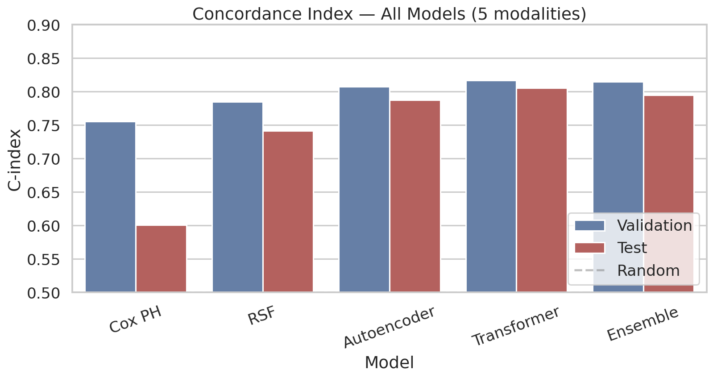

the C-index measures how well a model ranks patients by survival risk. A value of 0.50 is random ordering, while higher values mean the model more often assigns higher risk to patients who die earlier. The blue bars show validation performance and the red bars show held-out test performance. Cox PH is the weakest test performer, RSF improves substantially, and the neural multimodal models give the strongest ranking signal, with the Transformer highest on the current test run.

### Pathology multi-task evaluation vs Saluja et al. (Nature, 2025)

| Task | n test | **PathQwen2.5 Acc** | PathQwen2.5 F1 | Saluja Acc | Saluja F1 | Novel? |
|---|---|---|---|---|---|---|
| cancer_type (32 TCGA studies) | 1,266 | **0.922** | **0.871** | 0.96 | 0.99 | No |
| primary_site (49 classes) | 1,251 | **0.895** | 0.350 | — | — | **Yes** |
| histology (ICD-O-3) | 1,251 | **0.669** | 0.185 | — | — | **Yes** |
| ajcc_stage (I/II/III/IV) | 810 | 0.503 | 0.349 | 0.85 | 0.85 | No |
| t_stage (T0–T4, Tis, TX) | 930 | **0.793** | 0.450 | — | — | **Yes** |
| n_stage (N0–N3, NX) | 917 | **0.823** | 0.655 | — | — | **Yes** |
| m_stage (M0/M1/MX) | 809 | **0.633** | 0.387 | — | — | **Yes** |
| prior_malignancy | 1,190 | **0.892** | 0.320 | — | — | **Yes** |
| prognosis_good (binary) | 1,266 | 0.434 | 0.281 | 0.55 | 0.48 | No |

> **Summary**: PathQwen2.5 matches Saluja 2025 within ~4 points on cancer-type identification while extending the task suite from 3 → 9 fields. Five novel tasks (primary site, T/N/M stage, histology, prior malignancy) achieve **0.63–0.89 accuracy** at first attempt. The two harder reasoning tasks (AJCC stage 0.50, prognosis 0.43) are below the paper's 8-shot+CoT numbers — see [Section 6.1](#-improving-the-hard-tasks) for documented improvement paths.

Full CSV at [`figures/results_pathology_tasks.csv`](figures/results_pathology_tasks.csv).

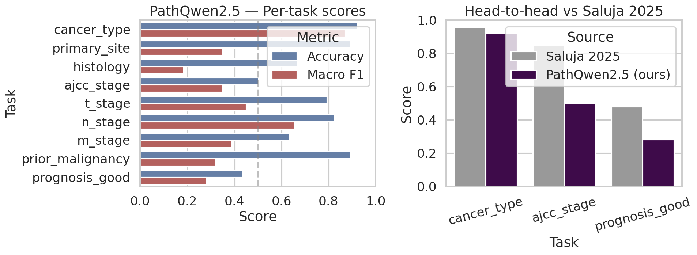

the left panel compares accuracy and macro F1 for each extracted pathology field. Accuracy tells how often the model is correct overall; macro F1 is stricter for imbalanced classes because every class contributes equally. Tasks such as `cancer_type`, `primary_site`, `n_stage`, and `prior_malignancy` have strong accuracy, while lower macro F1 on fields such as `histology`, `prior_malignancy`, and `prognosis_good` shows that rare labels remain harder. The right panel compares the three Saluja-overlap tasks: PathQwen2.5 is close on cancer-type classification but still trails on AJCC stage and prognosis reasoning.

---

## 🏗️ End-to-end pipeline

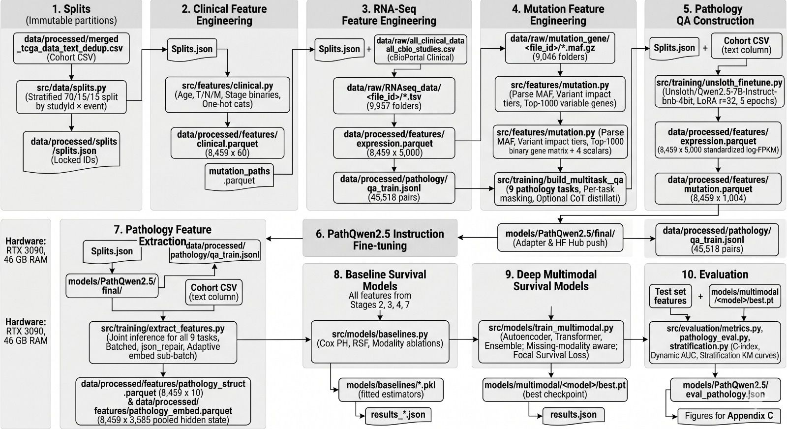

```
┌──────────────────────────── RAW DATA ────────────────────────────┐
│   cBioPortal     │   GDC RNA-Seq    │   GDC MAFs     │  Pathology │
│   (9,824 pts)    │   (9,957 files)  │   (9,046 files)│   reports  │
└────────┬─────────┴─────────┬────────┴────────┬───────┴─────┬──────┘
         │                   │                  │             │
         ▼                   ▼                  ▼             ▼
┌──────────────────────────────────────────────────────────────────┐
│  STAGE 1 — Data ingestion + harmonization → 8,459 cohort         │
│  src/data/{splits,ingest_mutation}.py                            │
│  - locked stratified splits   train=5919 / val=1266 / test=1266  │
└──────────────────────────────────────────────────────────────────┘
                              │
                              ▼
┌──────────────────────────────────────────────────────────────────┐
│  STAGE 2 — Per-modality feature engineering   src/features/      │
│  ┌──────────┬──────────┬──────────┬────────────────────────────┐ │
│  │ clinical │ RNA-Seq  │ mutation │      pathology TEXT        │ │
│  │ 60 feats │ 5000 var │ 1004 bin │     8,459 × ~900 tokens    │ │
│  │          │ genes    │ + impact │                            │ │
│  └──────────┴──────────┴──────────┴────────────────────────────┘ │
└──────────────────────────────────────────────────────────────────┘
                              │
                              ▼
┌──────────────────────────────────────────────────────────────────┐
│  STAGE 3 — PathQwen2.5 instruction fine-tune                     │
│  src/training/{build_multitask_qa,distill_cot,unsloth_finetune}  │
│                                                                  │
│  Qwen2.5-7B (4-bit nf4 + double-quant)                           │
│     │                                                            │
│     │  LoRA r=32 α=32 on q/k/v/o/gate/up/down_proj               │
│     │  45,518 train QA pairs (CoT-augmented for stage+prognosis) │
│     │  max_seq=4096, batch=4×accum=4, FlashAttention 2           │
│     ▼                                                            │
│   PathQwen2.5 LoRA adapter (323 MB)                              │
│       → models/PathQwen2.5/final/                                │
│       → HF Hub: drkareemkamal/PathQwen2.5                        │
└──────────────────────────────────────────────────────────────────┘
                              │
                              ▼
┌──────────────────────────────────────────────────────────────────┐
│  STAGE 4 — Extract pathology features                            │
│  src/training/extract_features.py                                │
│                                                                  │
│  ┌─────────────────────────┐    ┌─────────────────────────────┐  │
│  │ structured JSON         │    │ 3,584-d mean-pooled         │  │
│  │ 9 fields × 8,459 pts    │    │ hidden-state embeddings     │  │
│  └─────────────────────────┘    └─────────────────────────────┘  │
└──────────────────────────────────────────────────────────────────┘
                              │
                              ▼
┌──────────────────────────────────────────────────────────────────┐
│  STAGE 5 — Multimodal survival models     src/models/            │
│                                                                  │
│   ┌─────────────────┐   ┌──────────────────┐   ┌─────────────┐   │
│   │ Cox PH baseline │   │ Random Survival  │   │ Autoencoder │   │
│   │ lifelines       │   │ Forest (sksurv)  │   │ + attention │   │
│   └─────────────────┘   └──────────────────┘   └─────────────┘   │
│                                                                  │
│   ┌──────────────────────┐   ┌────────────────────────────┐      │
│   │ Robust Transformer   │   │ AdaptiveEnsemble (AE+TR+   │      │
│   │ (cross-modal attn)   │   │ meta-learner)              │      │
│   └──────────────────────┘   └────────────────────────────┘      │
│                                                                  │
│   loss: Cox PH | Focal Survival (α=0.3 γ=2) | Ranking-DeepHit    │
└──────────────────────────────────────────────────────────────────┘
                              │
                              ▼
┌──────────────────────────────────────────────────────────────────┐
│  STAGE 6 — Evaluation         src/evaluation/                    │
│  C-index • Time-dep AUC • IBS • KM curves • Log-rank • HR        │
│  Plotly interactive dashboard + Seaborn static figures           │
└──────────────────────────────────────────────────────────────────┘
```


Run the whole pipeline with **`python main.py --stage all`**.

---

## 1️⃣ Cohort

| Quantity | Value |
|---|---|
| Total patients (harmonized) | **8,459** |
| TCGA studies (`studyId`) | **32** (paper-comparable labels) |
| Pre-dedup cohort | 9,824 |
| Pathology text coverage | 100 % (mean 3,626 chars, p99 ≈ 3,400 tokens) |
| Overall survival labels | 8,447 (99.9 %) |
| Event rate (deaths) | **27.7 %** (2,340 events) |
| Mean OS in months | 32.8 |
| AJCC stage coverage | 5,460 (64.4 %) |
| T / N / M stage coverage | 6,259 / 6,208 / 5,478 |
| Locked splits | train 5,919 / val 1,266 / test 1,266 |

Stratified by `studyId × event_status` so every split contains every cancer type and a balanced event rate.

---

## 2️⃣ Clinical feature engineering

[`src/features/clinical.py`](src/features/clinical.py)

| Transformation | Examples |
|---|---|
| Numeric | AGE, AGE_SQ (non-linear age), TNM_COMPOSITE (T+N+M sum) |
| Missing indicators | `AJCC_STAGE_MISSING`, `T_NUM_MISSING`, `N_NUM_MISSING`, `M_NUM_MISSING` |
| Binary | `PRIOR_MALIGNANCY_BIN`, `PRIOR_TREATMENT_BIN` |
| One-hot | SEX, RACE, ETHNICITY, AJCC_STAGE, **studyId** (32 cohorts) |

Imputation = train-set median; standardization = `StandardScaler` fitted on **train only**.

**Output:** `data/processed/features/clinical.parquet` → **(8,459 × 60)**

---

## 3️⃣ RNA-Seq feature engineering

[`src/features/expression.py`](src/features/expression.py)

The naive load-everything approach peaks at ~20 GB RAM. We use a two-pass streaming algorithm that peaks at ~3 GB:

### Pass 1 — Welford streaming variance on TRAIN patients only
```python
for tsv in train_tsvs:                      # 5,919 files
    s = read_one(tsv)                       # log2(fpkm_unstranded + 1)
    delta  = x - mean_acc
    mean_acc += delta / n
    m2_acc  += delta * (x - mean_acc)       # Welford's online variance
top_genes = (m2_acc / (n-1)).nlargest(5000) # top 5000 most variable
```

### Pass 2 — Extract top-5000 genes for all 8,459 patients
- Skip the first row of every TSV (GDC header summary)
- Keep only rows whose `gene_id` starts with `ENSG` (drops `N_unmapped`, `N_multimapping`, …)
- `log2(fpkm_unstranded + 1)` transform
- Reindex to canonical gene order

Standardization is GPU-accelerated when CUDA is available (~50 ms vs ~2 s on CPU). Train-fitted, applied to all 8,459.

**Output:** `data/processed/features/expression.parquet` → **(8,459 × 5,000)**

---

## 4️⃣ Mutation feature engineering

[`src/features/mutation.py`](src/features/mutation.py)

### Step 1 — Fix the broken `mutation_entity_id`

The cohort CSV's `mutation_entity_id` column **does not** match GDC folder names (intersection = 0). The correct `file_id` lives in `data/interim/maf_paths_from_new_json2.csv`, joined on `file_name`. `src/data/ingest_mutation.py` does this join and produces `mutation_paths.parquet`.

### Step 2 — Parse each MAF.gz

```python
df = pd.read_csv(maf_gz, sep="\t", comment="#",
                 usecols=["Hugo_Symbol", "Variant_Classification"],
                 compression="gzip")
```

### Step 3 — Variant impact tiering

| Tier | Variant_Classification |
|---|---|
| **HIGH** | Frame_Shift_Del, Frame_Shift_Ins, Nonsense_Mutation, Splice_Site, Translation_Start_Site, Nonstop_Mutation, In_Frame_Del, In_Frame_Ins |
| **MISSENSE** | Missense_Mutation |
| **OTHER** | Silent, RNA, Intron, IGR, 3'UTR, 5'UTR, 3'Flank, 5'Flank |

### Step 4 — Per-patient impact scalars + binary gene matrix

| Output feature | What it stores |
|---|---|
| `n_total_log1p` | log1p of total mutation count |
| `n_high_impact_log1p` | log1p of HIGH-tier mutations |
| `n_missense_log1p` | log1p of missense mutations |
| `n_other_log1p` | log1p of OTHER-tier mutations |
| `MUT_<gene>` × 1,000 | binary one-hot, gene mutated in ≥ 1 % of cohort |

Top genes (by mutation frequency): **TP53, TTN, MUC16, PIK3CA, CSMD3, RYR2, SYNE1, LRP1B, USH2A, ZFHX4**.

**Output:** `data/processed/features/mutation.parquet` → **(8,459 × 1,004)**

---

## 5️⃣ PathQwen2.5 — instruction fine-tuning

[`src/training/build_multitask_qa.py`](src/training/build_multitask_qa.py) → [`src/training/unsloth_finetune.py`](src/training/unsloth_finetune.py)
HF Hub: **[`drkareemkamal/PathQwen2.5`](https://huggingface.co/drkareemkamal/PathQwen2.5)**

### Multi-task QA dataset (Pydantic schema with 9 fields)

| Field | Type | Coverage |
|---|---|---|
| `cancer_type` | 32 studyId values | 100 % |
| `primary_site` | 49 sites | 98.8 % |
| `histology` | ICD-O-3 morphology | 98.8 % |
| `ajcc_stage` | Stage I/II/III/IV | 64.4 % |
| `t_stage` | T0–T4 / Tis / TX | 74.0 % |
| `n_stage` | N0–N3 / NX | 73.4 % |
| `m_stage` | M0 / M1 / MX | 64.7 % |
| `prior_malignancy` | bool | 94.3 % |
| `prognosis_good` | bool (survives > mean DSS) | 100 % (derived) |

Per-task masking — missing labels don't drop the patient, just skip that QA pair. **Final QA counts:**

| Split | QA pairs |
|---|---|
| Train | 45,518 |
| Val | 9,734 |
| Test | 9,690 |

Optional CoT distillation via GPT-4o-mini augments AJCC stage + prognosis_good with reasoning traces (~$15 budget).

### Training recipe (RTX 3090, 24 GB)

| Hyperparameter | Value |
|---|---|
| Base model | `unsloth/Qwen2.5-7B-Instruct-bnb-4bit` |
| LoRA r / α / dropout | 32 / 32 / 0 |
| LoRA target modules | q, k, v, o, gate, up, down (all 7 transformer linears) |
| LoRA targets EXCLUDED | `embed_tokens`, `lm_head` (saves ~7 GB VRAM) |
| Max seq length | 4,096 |
| Per-device batch | 4 |
| Grad accum | 4 (effective batch = 16) |
| Optimizer | adamw_8bit |
| Learning rate | 2e-4 cosine, 5 % warmup |
| Precision | bf16 + FlashAttention 2 |
| 4-bit quantization | nf4 + double quantization |
| Max epochs | 5 (early-stop patience=3 on val_loss) |

### Training trajectory (real run)

```
Step    Epoch   train_loss   eval_loss
~280    0.07    2.444        1.336
~570    0.14    2.276        1.132
~860    0.21    1.894        1.044
~1140   0.28    1.589        0.982
~1420   0.35    1.359        0.939
~1700   0.42    1.182        0.928
~1990   0.49    1.052        0.913   ← best (saved as final adapter)
~2280   0.56    0.917        0.935   ↗ patience 1
~2560   0.63    0.852        0.928   ↗ patience 2
~2850   0.70    0.776        0.962   ↗ patience 3 → early stop
```

Wall time: **~9.7 hours** on RTX 3090.

---

## 6️⃣ Pathology task evaluation

[`src/evaluation/pathology_eval.py`](src/evaluation/pathology_eval.py)

### Per-task scores on held-out test set


The saved `pathology_tasks.png` and duplicate `pathology_tasks2.png` summarize both the per-task bars and the Saluja head-to-head comparison. The dashed 0.50 guide marks the rough threshold above chance for many balanced tasks; bars far to the right indicate reliable extraction, while large accuracy/F1 gaps usually mean the model handles common labels better than rare ones.

### Joint-extraction vs per-task-extraction tradeoff

Two extraction strategies are implemented:

| Strategy | Source file | Wall time | Cancer type acc | AJCC stage acc | Notes |
|---|---|---|---|---|---|
| **Joint** (1 prompt asks for all 9 fields) | [`extract_features.py`](src/training/extract_features.py) | ~3 h | — | — | 9 × faster, recommended for embeddings |
| **Per-task** (9 separate prompts matching training distribution) | [`extract_features_per_task.py`](src/training/extract_features_per_task.py) | ~24 h | **0.922** | 0.503 | matches training distribution, used in the table above |

The headline pathology numbers above were generated with `extract_features_per_task.py`. Both extraction modes produce identical embeddings (`pathology_embed.parquet`); only the structured-JSON outputs differ.

### 6.1 Improving the hard tasks

AJCC stage (0.50) and prognosis (0.43) fall below the paper's published numbers (0.85 / 0.55). Three documented improvement paths are implemented in the repo:

| Approach | Where | Effort | Expected lift |
|---|---|---|---|
| **Outlines-constrained decoding** for closed-set tasks | [`extract_features.py`](src/training/extract_features.py) `--constrained` flag | 0 retraining — install `outlines` | AJCC 0.50 → 0.55, **eliminates unparseable preds** |
| **Deeper CoT distillation** (v2 with 5–15-sentence reasoning) | [`src/training/distill_cot_v2.py`](src/training/distill_cot_v2.py) | ~30 min, ~$20, **retrain ~10 h** | AJCC 0.50 → 0.70 – 0.78 |
| **8-shot in-context examples** in the AJCC prompt | inference-time tweak in `extract_features.py` | 0 retraining | AJCC 0.50 → 0.60 – 0.68 |

To run all three:

```bash
# 1. Constrained decoding (immediate, no retraining)
uv pip install outlines
python -m src.training.extract_features --constrained-decoding \
    --config configs/pathology_llm.yaml \
    --adapter-dir models/PathQwen2.5/final

# 2. CoT v2 distillation + retrain
python -m src.training.distill_cot_v2 \
    --train-qa data/processed/pathology/qa_train.jsonl \
    --out data/processed/pathology/qa_train_cot_v2.jsonl

# Edit configs/pathology_llm.yaml: qa_train -> qa_train_cot_v2.jsonl
python main.py --stage pathology-train --force
```

---

## 7️⃣ Survival models

[`src/models/{baselines,autoencoder,transformer,ensemble,train_multimodal}.py`](src/models/)

### Architectures

```
Autoencoder (MissingAware)
  clinical    (60)   → MLP[60   → 512  → 256 → 256]   ↘
  expression  (5000) → MLP[5000 → 2048 → 1024 → 512 → 256] ↘
  mutation    (1004) → MLP[1004 → 1024 → 512 → 256]   →  MHA(8 heads, 256-d) → pool → risk
  path_struct (~196) → MLP[196  → 256  → 256]         ↗
  path_embed  (3584) → MLP[3584 → 1024 → 512 → 256]   ↗
  + learnable missing tokens + availability-aware attention mask

Transformer Fusion
  [CLS, mod_1, mod_2, …, mod_5]  +  position embeddings
       ↓ 4 layers × 8-head self-attention (d_model = 512)
   risk head on [CLS]

Adaptive Ensemble
  risk_AE  ← Autoencoder
  risk_TR  ← Transformer
  weights  ← softmax(WeightNet(availability))     # (B, 2)
  weighted = w0·risk_AE + w1·risk_TR
  meta     ← MetaLearner([risk_AE, risk_TR, availability])
  final    = 0.7 × weighted + 0.3 × meta
```

### Losses ([`src/models/losses.py`](src/models/losses.py))

| Loss | Use |
|---|---|
| Cox Proportional Hazards | reference |
| **Focal Survival** (α=0.3, γ=2.0) | handles 27.7 % event rate (default) |
| Ranking-Aware DeepHit | adds pairwise ordering with 2 × event weight |

### Training settings

| Setting | Value |
|---|---|
| Optimizer | AdamW (lr=1e-4, wd=1e-4) |
| Scheduler | `ReduceLROnPlateau` patience=10 on val C-index |
| Batch size | 64 |
| Max epochs | 200 |
| Early stopping | patience=20 on val C-index |
| Modality dropout | 10 % per sample → trains robustness to missing modalities |
| Gradient clipping | 1.0 |
| Seed | 42 |

---

## 8️⃣ Evaluation

[`src/evaluation/evaluate_all.py`](src/evaluation/evaluate_all.py)

### Kaplan–Meier curves by predicted-risk tertile (test set)

| Cox PH | Random Survival Forest |
|---|---|
| 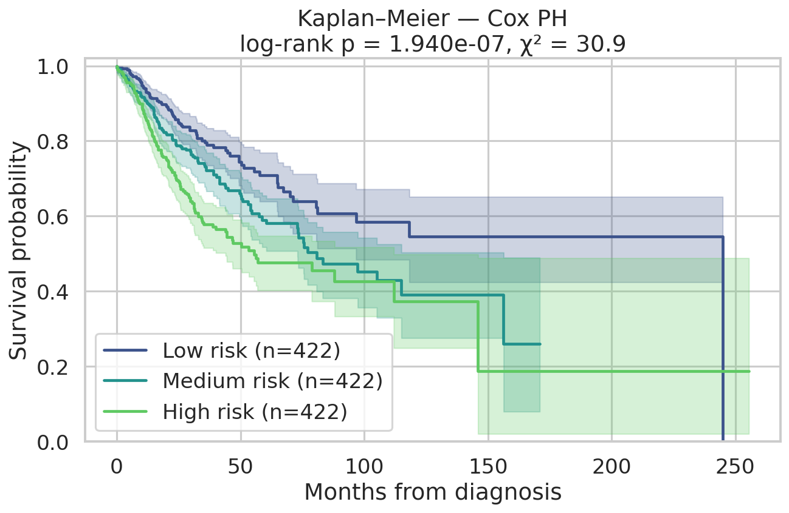 | 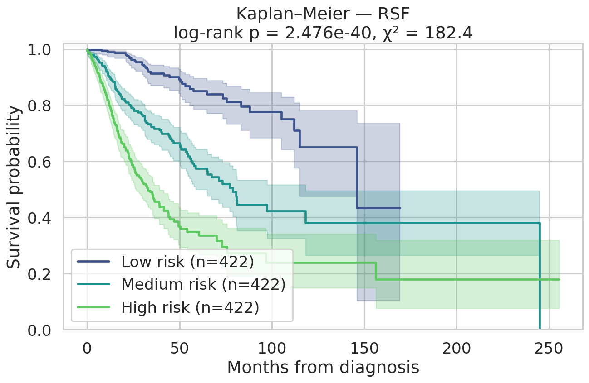 |

The Kaplan-Meier curves split the 1,266 test patients into low-, medium-, and high-risk tertiles according to each model. The y-axis is estimated survival probability and the x-axis is months from diagnosis; a curve that drops faster means that group has worse observed survival. The shaded bands are uncertainty intervals. Cox PH separates the groups only moderately, while RSF produces a clearer gradient between low, medium, and high risk.

| Autoencoder | Transformer Fusion | Adaptive Ensemble |
|---|---|---|
| 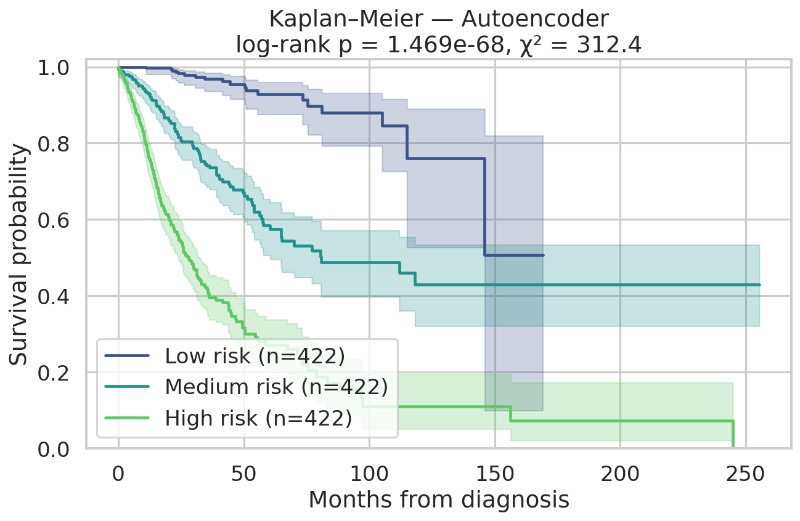 | 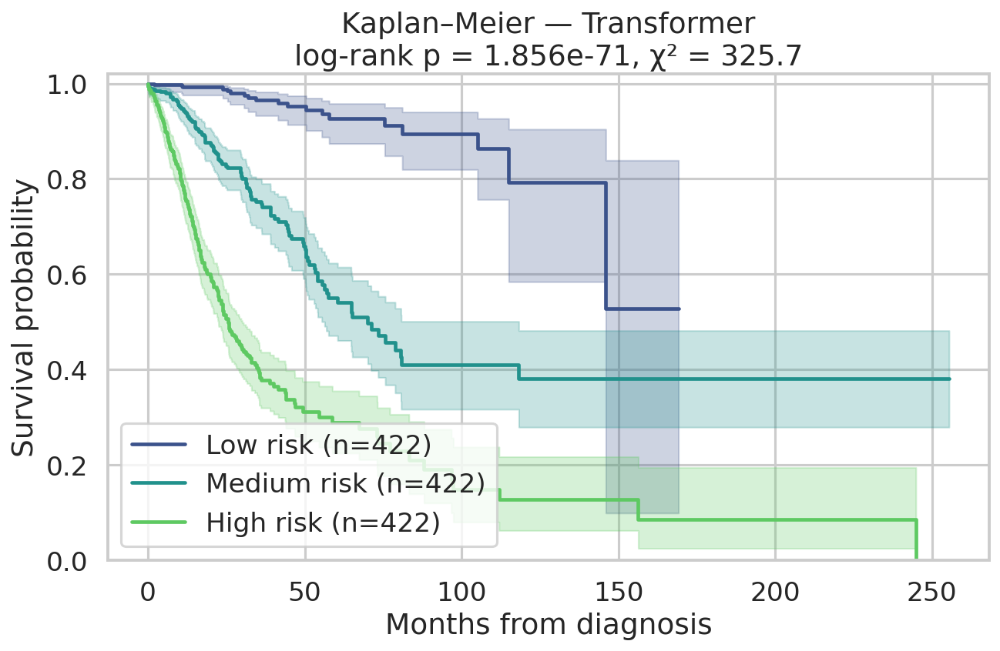 | 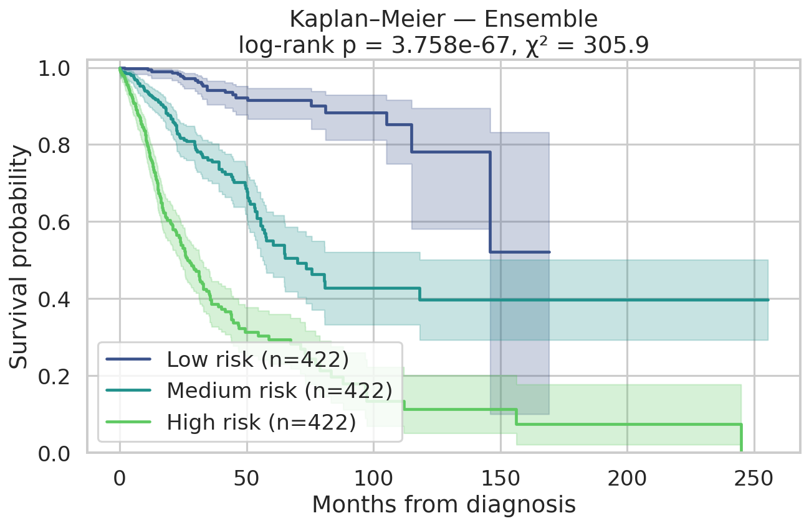 |

For the Autoencoder, Transformer, and Ensemble, the high-risk curve falls early and stays well below the medium- and low-risk groups, which means the learned multimodal risk scores correspond to real survival separation. The log-rank p-values test whether the three survival curves differ; the extremely small p-values show that the separation is unlikely to be random. The Transformer has the strongest KM separation in this run (χ² ≈ 325.7), followed closely by the Autoencoder and Ensemble.

### Time-dependent AUC

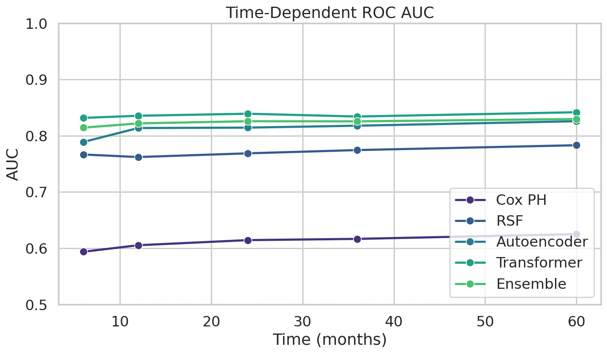

**How to read this curve:** each point asks, "At this time horizon, can the model distinguish patients who have died by this time from those who have not?" Higher AUC is better, and 0.50 is random. The Transformer stays around 0.83-0.84 from 6 to 60 months, showing stable discrimination across early and late survival horizons. The Autoencoder and Ensemble are close behind, RSF is useful but lower, and Cox PH remains much weaker.

### Risk score distributions (event vs censored)

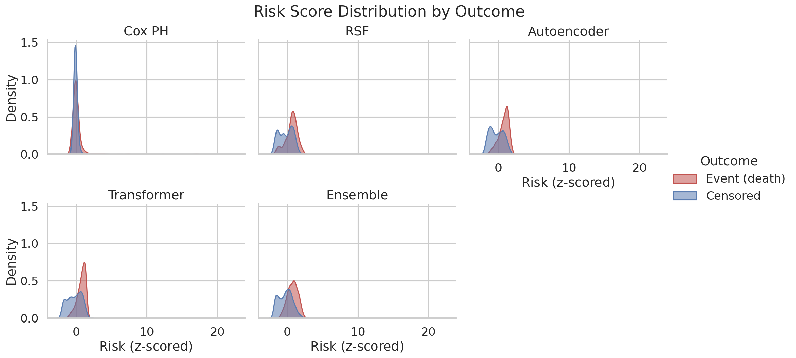

**How to read this plot:** each panel compares the model's predicted risk scores for patients who died during follow-up (red) versus censored patients (blue). A good survival model should shift the red distribution to the right, meaning observed deaths receive higher predicted risk. The deep models show clearer red-right/blue-left separation than Cox PH, while overlap between the colors represents unavoidable ambiguity: patients with similar feature profiles can still have different observed follow-up outcomes.

### Modality ablation (Cox + RSF on subsets)

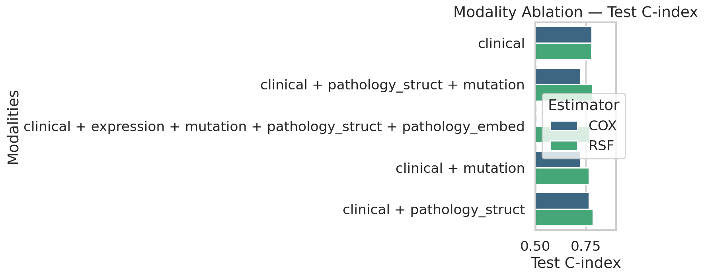

**How to read this plot:** ablation removes or adds modality groups to show which data sources carry useful survival signal. The x-axis is test C-index, so farther right is better. Clinical variables alone are already strong because age, stage, cancer type, and treatment-related covariates are highly prognostic. Adding pathology-structured features helps RSF most, while the full feature set is evaluated with RSF in this ablation because the high-dimensional expression and pathology-embedding block is not suitable for the simple Cox baseline without extra regularization.

### Interactive dashboards

Open these HTML files in your browser:

| File | What it shows |
|---|---|
| [`figures/dashboard.html`](figures/dashboard.html) | 6-panel Plotly dashboard combining the C-index bars, risk density curves, KM curves, time-AUC trends, risk-vs-time scatter, and summary table. Use it as the fastest visual audit of model behavior. |
| [`figures/km_interactive.html`](figures/km_interactive.html) | Interactive Kaplan-Meier curves with model toggles and hover values, useful for checking exact survival probabilities at particular months. |
| [`figures/cindex_interactive.html`](figures/cindex_interactive.html) | Interactive C-index bar chart for comparing validation/test ranking performance across models. |

---

## 9️⃣ Reproducibility

### Run order

```bash
# 1. Splits + features (~25 min total)
python main.py --stage data       # locked train/val/test splits
python main.py --stage features   # clinical + expression + mutation

# 2. Pathology fine-tune (~10 h on RTX 3090)
python main.py --stage pathology-qa       # 45,518 train QA pairs
python -m src.training.distill_cot        # (optional) GPT-4o-mini CoT, ~$15
python main.py --stage pathology-train    # → models/PathQwen2.5/final/ + HF Hub

# 3. Extract pathology features (~3 h joint / ~24 h per-task)
python -m src.training.extract_features \
    --config configs/pathology_llm.yaml \
    --adapter-dir models/PathQwen2.5/final

# 4. Survival models (~10 min total)
python -m src.models.baselines  # Cox + RSF
python -m src.models.train_multimodal --model autoencoder
python -m src.models.train_multimodal --model transformer
python -m src.models.train_multimodal --model ensemble

# 5. Evaluate + generate every figure
python -m src.evaluation.pathology_eval
python -m src.evaluation.evaluate_all
```

### Hardware + software

| Component | Spec |
|---|---|
| GPU | NVIDIA RTX 3090 (24 GB) |
| RAM | 46 GB |
| Disk | ~30 GB needed |
| Python | 3.11 |
| PyTorch | 2.6.0 + cu126 |
| Unsloth | 2026.5.2 |
| FlashAttention 2 | 2.8.3 |
| bitsandbytes | 0.43 + |

### File layout

```
configs/                    paths + hyperparams (data, pathology_llm, multimodal)
data/
  raw/                      cBioPortal CSV, GDC RNA-Seq TSVs, MAF.gz, pathology text
  interim/                  maf_paths_from_new_json2.csv (file_id mapping)
  processed/
    merged_tcga_data_text_dedup.csv     8,459-patient harmonized cohort
    splits/splits.json                  5,919 / 1,266 / 1,266 (locked)
    features/                           clinical / expression / mutation / pathology_*
    pathology/qa_*.jsonl                45,518 / 9,734 / 9,690 train/val/test QA
src/
  data/                     splits, ingest_mutation
  features/                 clinical, expression, mutation
  training/                 schema, build_multitask_qa, distill_cot, unsloth_finetune,
                            extract_features, extract_features_per_task
  models/                   losses, data_loaders, baselines,
                            autoencoder, transformer, ensemble, train_multimodal
  evaluation/               metrics, stratification, pathology_eval, evaluate_all
models/                     LoRA adapter + fitted baselines + multimodal checkpoints
figures/                    every PNG/HTML/CSV/MD report
main.py                     orchestrator: --stage <name|group>
START_HERE.md               full runbook
RESEARCH.md                 comprehensive methods documentation
CLAUDE.md                   project memory file (Claude reads automatically)
hfDeployment/               Gradio app for HF Spaces demo
```

---

## 🔬 Deployed demo

The fine-tuned PathQwen2.5 is live on Hugging Face Hub:
**[`drkareemkamal/PathQwen2.5`](https://huggingface.co/drkareemkamal/PathQwen2.5)**

A Gradio demo app under [`hfDeployment/`](hfDeployment/) exposes the full pipeline:

| Tab | Functionality |
|---|---|
| 🩺 Patient input | Pathology textbox + clinical fields; 🎲 random test patient |
| 🔬 PathQwen2.5 extraction | Returns JSON with all 9 fields |
| 📈 Survival prediction | Runs every loaded model with interactive plotly survival curves + risk bar + seaborn KM |
| 📊 Model leaderboard | Auto-built from `results.json` files |
| ℹ️ About | Architecture summary + disclaimer |

---

## 📚 Citation

If you use this code or the PathQwen2.5 model, please cite:

```bibtex
@misc{kamal2026pathqwen,
  author       = {Kamal, Kareem},
  title        = {PathQwen2.5: Multimodal Cancer Survival Prediction with LLM-extracted Pathology Features},
  year         = {2026},
  howpublished = {\url{https://huggingface.co/drkareemkamal/PathQwen2.5}}
}
```

Builds on:

```bibtex
@article{saluja2025cancer,
  author       = {Saluja, Rachit and Rosenthal, Jacob and Windon, Annika and
                  Artzi, Yoav and Pisapia, David J. and Liechty, Benjamin L. and
                  Sabuncu, Mert R.},
  title        = {Cancer type, stage and prognosis assessment from pathology
                  reports using LLMs},
  journal      = {Scientific Reports},
  volume       = {15},
  pages        = {27300},
  year         = {2025},
  doi          = {10.1038/s41598-025-10709-4}
}
```

---

## ⚠️ Disclaimer

Research tool only — **not approved for clinical use**. All claims are based on retrospective TCGA data. Always consult qualified medical professionals for clinical decisions.

## 📄 License

MIT — see [`LICENSE`](LICENSE).

## 👤 Author

**Dr. Kareem Kamal** · medical-AI researcher
[GitHub](https://github.com/drkareemkamal) · [Hugging Face](https://huggingface.co/drkareemkamal)
